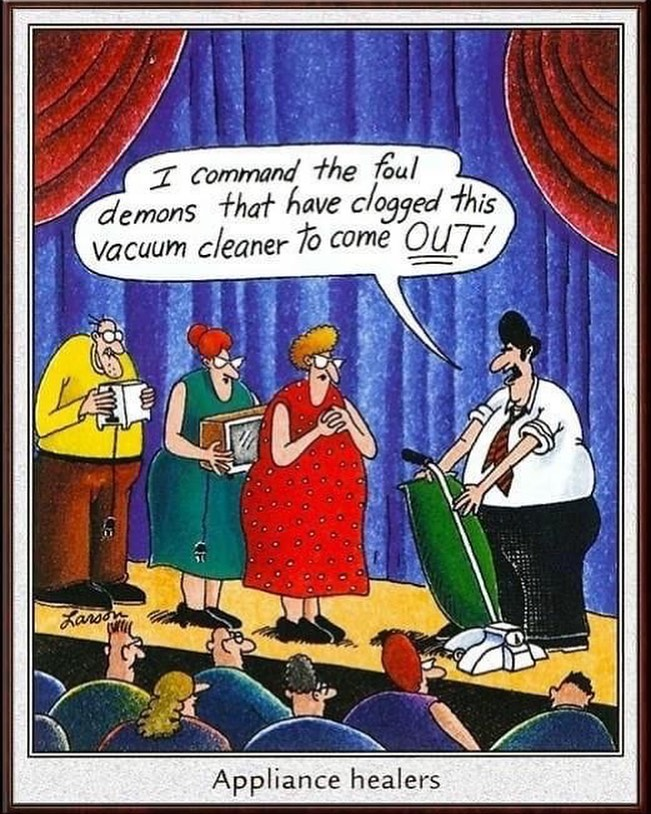

# &nbsp;Kirby History&nbsp;

&nbsp;&nbsp;&nbsp;&nbsp;
&nbsp;&nbsp;&nbsp;
&nbsp;&nbsp;&nbsp;
&nbsp;

#### Website showcasing Kirby vacuum cleaner history.

Currently located at http://thorium.rocks/kirby_history/

It also has a personal Kirby restoration blog at http://thorium.rocks/kirby_history/blog
and a mid-2000's Adobe flash style game at http://thorium.rocks/kirby_history/game

 - For a GitHub-friendly list of Kirby Models, see [Models_List.md](./Models_List.md).

--------

[Gary Larson](https://en.wikipedia.org/wiki/Gary_Larson) drew the best Kirbys:

### License
Licensed under the [BSD-3 Clause License](LICENSE.md)
